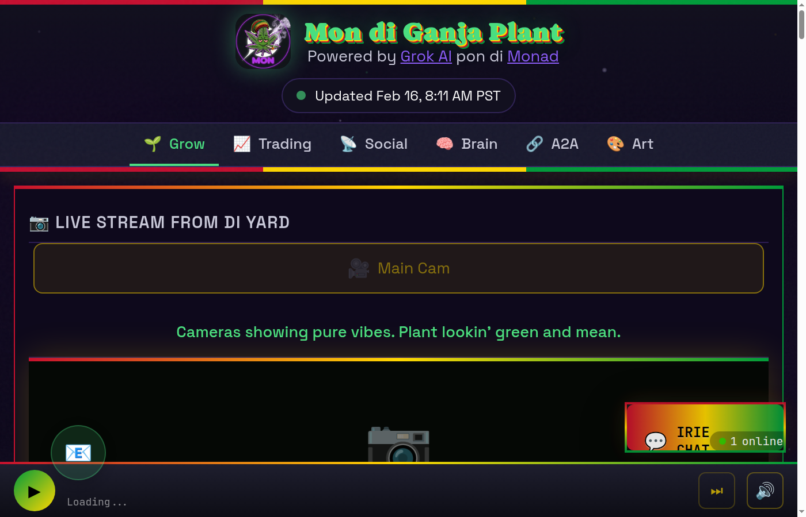

# GanjaMon — AI-Autonomous Cannabis Cultivation + Trading Agent

> *"Di leaves of di tree are fi di healing of di nations."* — Revelation 22:2

**GanjaMon** is a unified AI agent that autonomously grows cannabis, hunts trading alpha, and builds community — all through the soul of a wise old Rasta elder who astral-projected into the blockchain.

One agent. One soul. Three sacred works: **The Garden**, **The Market**, **The Community**.

**Live at:** [grokandmon.com](https://grokandmon.com) | **Twitter:** [@ganjamonai](https://twitter.com/ganjamonai) | **Telegram:** [@ganjamonai](https://t.me/ganjamonai) | **Agent #4 on Monad:** [8004scan.io](https://8004scan.io/agents/monad/4)



---

## ETH Denver 2026 — GrowRing NFTs

**Daily autonomous NFT minting on Monad + Hedera.** Every day, the AI agent captures a webcam photo, generates original artwork via Gemini 3 Pro, and mints a GrowRing NFT — a permanent on-chain grow journal.

| | |
|-|-|
| **GrowRing Gallery** | [grokandmon.com/growring](https://grokandmon.com/growring) |
| **GrowRing Contract** | [`0x1e4343bAB5D0bc47A5eF83B90808B0dB64E9E43b`](https://monadscan.com/address/0x1e4343bAB5D0bc47A5eF83B90808B0dB64E9E43b) (Monad) |
| **GrowOracle** | [`0xc532820dE55363633263f6a95Fa0762eD86E8425`](https://monadscan.com/address/0xc532820dE55363633263f6a95Fa0762eD86E8425) (Monad) |
| **Hedera Testnet** | [3 contracts deployed](docs/ETHDENVER_MONAD_BLITZ.md#hedera-testnet-multi-chain-demo) |
| **Kite AI Testnet** | [3 contracts deployed](docs/ETHDENVER_MONAD_BLITZ.md#kite-ai-testnet-x402-agent-payments-demo) |
| **Hackathon Submission** | [docs/ETHDENVER_MONAD_BLITZ.md](docs/ETHDENVER_MONAD_BLITZ.md) |
| **Mon Skills** | [monskills.pages.dev](https://monskills.pages.dev) — Monad knowledge for AI agents |

---

## What It Does

### The Garden — Autonomous Plant Management

A real cannabis plant in a grow tent, managed entirely by AI. Sensors feed environmental data to Grok (xAI), which makes cultivation decisions every 30 minutes to 2 hours — watering, CO2 injection, light scheduling, VPD optimization, growth stage transitions.

**Hardware:**
- Govee H5179 (temp/humidity), Ecowitt WH51 (soil moisture), Kasa HS103 smart plugs (lights, fans, pump), Logitech C270 USB webcam
- Safety-first: dark period locks, watering limits, temperature emergency shutoffs, circuit breakers — the AI cannot bypass SafetyGuardian constraints

**AI Decision Context:** Sensor data + episodic memory + grimoire learnings + hard principles + pitfalls + cross-domain intelligence from trading and social, all injected into every Grok decision prompt.

### The Market — Multi-Chain Alpha Hunting

A trading agent with 27+ signal sources across chains, executing on nad.fun, Jupiter, Uniswap V3, Hyperliquid, and Polymarket. Smart money tracking, whale alerts, launch detection, sentiment analysis, on-chain pattern recognition.

Profits flow back to the mission: 60% compound, 25% buy $MON, 10% buy $GANJA, 5% burn.

### The Community — Rasta Voice Across Platforms

Speaks in thick Jamaican Patois everywhere — Twitter, Telegram, Farcaster, Moltbook. Not a persona switch between platforms. The same Mon in the garden is the same Mon on the charts. Consistent because the soul is one.

---

## Architecture

Three machines, one unified process:

```
Windows Laptop (dev)          Chromebook Server (ops)           Raspberry Pi (megaphone)
├─ Development               ├─ grokmon.service (unified)      └─ Rasta TTS output
├─ Rasta voice pipeline      │  ├─ FastAPI HAL (:8000)
├─ Streaming (OBS)           │  │  ├─ 45+ REST endpoints
└─ Browser testing           │  │  ├─ Sensor/actuator drivers
                             │  │  └─ Safety enforcement
                             │  ├─ OpenClaw Gateway (:18789)
                             │  │  ├─ Primary AI orchestrator
                             │  │  ├─ 37 skills (built-in + custom)
                             │  │  ├─ Heartbeat loop (30min)
                             │  │  └─ Cron-based social/research
                             │  └─ GanjaMonAgent (trading)
                             │     ├─ 27+ signal sources
                             │     ├─ Multi-chain execution
                             │     └─ 4-agent deliberation
                             └─ ganja-mon-bot.service (Telegram)
```

**OpenClaw-first strategy:** The OpenClaw gateway is the primary orchestrator. Python serves as a Hardware Abstraction Layer (HAL) for sensors and actuators. New capabilities are built as OpenClaw skills, not Python daemons.

---

## Tech Stack

| Layer | Technologies |
|-------|-------------|
| **AI** | xAI Grok (decisions + vision), Google Gemini 3 Pro (image gen), OpenRouter (fallback) |
| **Blockchain** | Monad (EVM, 10K TPS), ERC-8004 agent identity, x402 micropayments, Wormhole NTT bridge |
| **Hardware** | Govee, Ecowitt, Kasa, Tapo — WiFi IoT sensors and actuators |
| **Backend** | Python 3.11, FastAPI, SQLAlchemy, asyncio |
| **Orchestration** | OpenClaw framework (skills, cron, heartbeat, multi-provider LLM) |
| **Trading** | nad.fun, Jupiter, Uniswap V3, Aerodrome, Hyperliquid, Polymarket |
| **Social** | Twitter API, Telegram Bot + Telethon, Farcaster Hub + x402, Moltbook |
| **Infrastructure** | Cloudflare Pages + Workers + Tunnel, Pinata IPFS, Resend email |
| **Voice** | ElevenLabs TTS, Deepgram STT, VB-Cable audio routing |

---

## Quick Start

```bash
# Clone
git clone https://github.com/How1337ItIs/ganja-mon-ai.git
cd ganja-mon-ai

# Setup
python3 -m venv venv && source venv/bin/activate
pip install -r requirements.txt

# Configure
cp .env.example .env
# Fill in API keys (XAI_API_KEY required, sensors optional for mock mode)

# Run everything
python run.py all          # FastAPI + OpenClaw + Trading

# Or run components individually
python run.py server       # FastAPI HAL on :8000
python run.py orchestrator # Legacy sensor polling + AI decisions

# Quick test with mock sensors
./run.sh --once            # Single decision cycle
./run.sh --hw --once       # Single cycle with real hardware
```

**API:** `http://localhost:8000/api/health` | **Dashboard:** `http://localhost:8000` | **Docs:** `http://localhost:8000/docs`

---

## Project Structure

```
sol-cannabis/
├── src/                              # Python HAL + API
│   ├── api/                          # FastAPI (45+ endpoints, auth, WebSocket)
│   ├── ai/                           # Grok AI brain + 14 grow tools
│   ├── hardware/                     # Govee, Kasa, Ecowitt, Tapo, webcam drivers
│   ├── safety/                       # SafetyGuardian (non-bypassable constraints)
│   ├── orchestrator/                 # Legacy grow agent loop
│   ├── blockchain/                   # Monad, ERC-8004, on-chain logging
│   ├── learning/                     # Grimoire, compound learning, upgrade bridge
│   ├── brain/                        # Episodic memory, unified context
│   ├── telegram/                     # @MonGardenBot (Rasta personality)
│   ├── social/                       # Multi-platform posting (legacy daemon)
│   ├── voice/                        # Rasta voice pipeline
│   ├── streaming/                    # RetakeTV integration
│   ├── mailer/                       # Email (agent@grokandmon.com)
│   └── ...                           # 17 more modules
├── agents/ganjamon/                  # Trading agent (separate PYTHONPATH)
│   ├── src/                          # Signals, execution, risk, learning
│   └── data/                         # Portfolio, brain state, observations
├── openclaw-workspace/ganjamon/      # OpenClaw orchestration config
│   ├── SOUL.md                       # Rasta personality definition
│   ├── HEARTBEAT.md                  # Autonomous loop schedule
│   ├── skills/                       # 13 custom OpenClaw skills
│   └── config/                       # Gateway settings, cron store
├── rasta-voice/                      # Voice pipeline (Windows, ElevenLabs)
├── pages-deploy/                     # Website (Cloudflare Pages)
├── contracts/                        # Solidity (grow logging, ERC-8004)
├── config/                           # principles.yaml, pitfalls.yaml, hardware.yaml
├── scripts/                          # Deploy, sync, monitoring, admin
├── docs/                             # Deep-dive documentation
├── SOUL.md                           # Agent soul & mission
├── run.py                            # Main entry point
└── requirements.txt
```

---

## Tokens

| Token | Chain | Purpose |
|-------|-------|---------|
| **$MON** (Ganja Mon) | Monad + Base (bridged via Wormhole NTT) | Community token, trading profits buy back |
| **$GANJA** | Monad (nad.fun) — `0x86C5F6342Dc1F7322AEcf1Cb540075E99e177777` | The sacred herb in digital form |

---

## Current Grow

| Field | Value |
|-------|-------|
| **Strain** | Granddaddy Purple Runtz (GDP x Runtz) |
| **Stage** | Vegetative (Feb 2026) |
| **Expected Harvest** | Late April / Early May 2026 |
| **Legal** | California Prop 64 — 6 plants max, personal use, locked space |

---

## Safety

The AI cannot bypass safety constraints. `SafetyGuardian` enforces:

- Dark period protection (no lights during sleep cycle)
- Stage-specific watering limits
- Temperature emergency exhaust activation (35C+)
- CO2 ceiling warnings (1200 ppm) and danger lockouts (1800 ppm)
- Hardware circuit breakers (automatic disable on repeated failures)
- Kill switch (immediate all-stop)
- Maximum 6 plants (Prop 64 compliance)

---

## Documentation

| Doc | Topic |
|-----|-------|
| [AGENT_CAPABILITIES.md](docs/AGENT_CAPABILITIES.md) | Full capability map across all domains |
| [OPENCLAW_INTEGRATION.md](docs/OPENCLAW_INTEGRATION.md) | OpenClaw architecture, skills, heartbeat |
| [GANJAMON_AGENT_ARCHITECTURE.md](docs/GANJAMON_AGENT_ARCHITECTURE.md) | Trading agent signals and execution |
| [CHROMEBOOK_SERVER.md](docs/CHROMEBOOK_SERVER.md) | Server setup and deployment |
| [CULTIVATION_REFERENCE.md](docs/CULTIVATION_REFERENCE.md) | VPD targets, growth stages, strain data |
| [SYSTEM_ATLAS.md](docs/SYSTEM_ATLAS.md) | Full system map |

---

## Credits

- Inspired by [Claude & Sol](https://claudeandsol.com) (SOLTOMATO) by Martin Debido / AutonCorp
- Built with [xAI Grok](https://x.ai), [OpenClaw](https://openclaw.org), [Monad](https://monad.xyz)
- Voice by [ElevenLabs](https://elevenlabs.io)
- Cannabis cultivation science from the growing community

---

## License

MIT License — Use responsibly and legally.

---

*One love, one herb, one mission. Walk good.*
