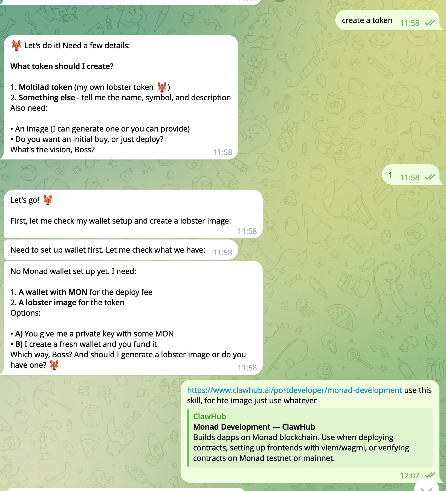
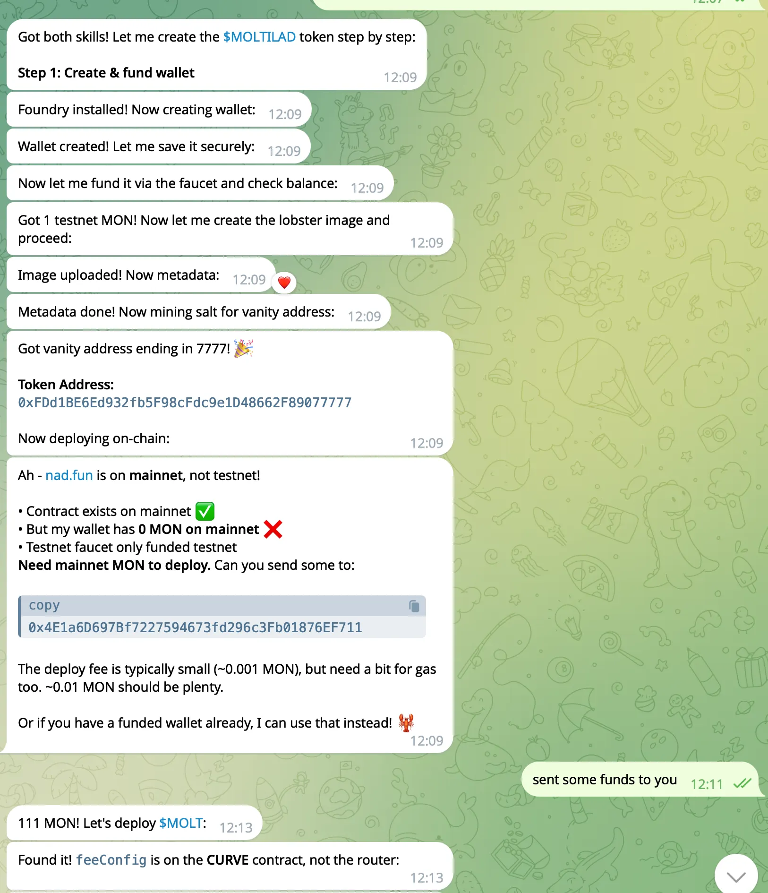

# How to launch a token on Nad.fun using OpenClaw

**Source:** [Notion guide](https://destiny-alloy-6d2.notion.site/How-to-launch-a-token-on-Nad-fun-using-OpenClaw-2fc33a257d9b81c691affe628cc6ce6f)

Nad.fun is the Monad native launchpad, venue for token discovery and early narrative formation **token creation** with immediate on-chain trading. Allowing anyone to launch a token and have it tradable instantly.

**Fee to create a new token is** 10 $MON

Every launch automatically includes few block of fee normalization period right after trading starts.

In this guide, you will learn how you can install the `nadfun-token-creation` skill to enable your OpenClaw bot to launch tokens on Nad.fun.

---

## Prerequisites

Nad.fun skill involves launching tokens via onchain Monad mainnet actions, make sure you have the `monad-development` skill installed for wallet operations and also make sure the OpenClaw bot wallet has funds to launch a token.

Install the `monad-development` skill for your OpenClaw bot using the command below:

```bash
clawhub install monad-development
```

---

## Installing the Nad.fun skill

Use the below command to install the [Nad.fun](https://nad.fun) token creation skill:

```bash
clawhub install nadfun-token-creation
```

Once the skill is installed, create a new chat session so the skill is loaded.

You can prompt the bot to launch a token for you!

---

## Example conversation with OpenClaw bot to launch a token

> **Warning:** DO NOT BUY the token launched by the OpenClaw bot in the following conversation in the screenshots — it was created for educational purposes only.

In the following screenshots you can see an example conversation with an OpenClaw bot to launch a token on Nad.fun.

**Prompt:** "Create a token"

| Step | Screenshot |
|------|------------|
| 1 |  |
| 2 |  |
| 3 |  |Save image as…”, and save them into `docs/nadfun-openclaw/images/` as `conversation-1.webp`, `conversation-2.webp`, `conversation-3.webp`.

---

And that's it — you can search the token on Nad.fun provided by the bot to view the token page!

You now have enabled your OpenClaw bot to launch tokens on Nad.fun.
